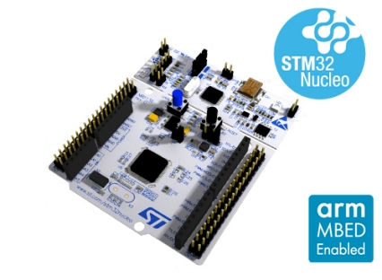

# Debugging Firmware with GDB and STM32F091

This is an exercise project. The two main goals are:

1. To get started with _GDB_ on microcontrollers.
2. To get started with writing a _Makefile_ for driving [GNU Arm Embedded Toolchain]
   (GCC) based project.

The project is inspired by a [Debugging Firmware with GDB] blog post.
And my natural need for learning and having fun, of course. ;-)

[GNU Arm Embedded Toolchain]: https://developer.arm.com/tools-and-software/open-source-software/developer-tools/gnu-toolchain/gnu-rm
[Debugging Firmware with GDB]: https://interrupt.memfault.com/blog/gdb-for-firmware-1

In addition, the following statements become true:

1. The _GCC_ command line required for compiling a _Cortex-Mx_ based code isn't black magic.
   Some of the flags aren't obvious at first sight, but they do become after a very short while.
2. The _[OpenOCD]_ command line required for programming and debugging a microcontroller firmware
   isn't black magic either. It takes a moment to learn, but then typing it becomes your second
   nature.

[OpenOCD]: http://openocd.org/

## About the development board

The [Debugging Firmware with GDB] blog post uses [nRF52840 development kit (PCA10056)] board
with Nordic's nRF52840 microcontroller (_Cortex-M4_).

I, on the other side, use [NUCLEO-F091RC development board] with ST's STM32F091RCTX
microcontroller (_Cortex-M0_).

Though the boards differ it their nature, any _Cortex-Mx_ board will serve the purpose equally
well. The generated assembly will generally differ, because _Cortex-M4_ (nRF52840) has much
richer instruction set than _Cortex-M0_ (STM32F091), but in this exercise I don't go deep enough
for this fact to matter.

|                  |
|:----------------------------------------:|
| NUCLEO-F091RC board used in the exercise |

[nRF52840 development kit (PCA10056)]: https://www.nordicsemi.com/Software-and-Tools/Development-Kits/nRF52840-DK
[NUCLEO-F091RC development board]: https://www.st.com/en/evaluation-tools/nucleo-f091rc.html

## Cross development tools

The following host-side cross development tools are in charge of making the experiment possible:

1. [GNU Arm Embedded Toolchain], which includes GCC (compiler) and GDB (debugger),
   version _10-2020-q4-major_ (official binaries).
2. Open On-Chip Debugger ([OpenOCD]) for programming and bridging GDB for remote debugging,
   version 0.11.0-rc1+dev-00026-gaaa6110d9-dirty (compiled from _git_ source code repository).

## Firmware

The target firmware is based on [Debugging Firmware with GDB] blog post example, but adapted
for STM32 microcontroller. Take a look at the source code found in this repository if you're
interested in details.

Basically, it's a simple UART example code to talk with a PC over a serial line. Using terminal
emulator on the PC side, an experiment with a conditional breakpoint can be conducted. (It could be
without the serial connection as well, but it's way cooler to work on the real hardware.)

## Building the firmware

    $ export PATH+=:/path/to/toolchain/bin
    $ make
    CC     main.c.o
    AS     startup_stm32f091rctx.s.o
    CC     system_stm32f0xx.c.o
    LINK   gdb-for-firmware.elf

## Flashing the microcontroller

    $ export PATH+=/path/to/openocd/bin
    $ openocd -d0 -f board/st_nucleo_f0.cfg                   \
          -c "program gdb-for-firmware.elf verify reset exit"
    Open On-Chip Debugger 0.11.0-rc1+dev-00026-gaaa6110d9-dirty (2021-01-13-19:14)
    Licensed under GNU GPL v2
    For bug reports, read
            http://openocd.org/doc/doxygen/bugs.html
    debug_level: 0
    
    srst_only separate srst_nogate srst_open_drain connect_deassert_srst
    
    target halted due to debug-request, current mode: Thread
    xPSR: 0xc1000000 pc: 0x08000108 msp: 0x20008000
    ** Programming Started **
    ** Programming Finished **
    ** Verify Started **
    ** Verified OK **
    ** Resetting Target **
    shutdown command invoked

## Debugging

    $ arm-none-eabi-gdb gdb-for-firmware.elf
    GNU gdb (GNU Arm Embedded Toolchain 10-2020-q4-major) 10.1.90.20201028-git
    Copyright (C) 2020 Free Software Foundation, Inc.
    (..)

    For help, type "help".
    Type "apropos word" to search for commands related to "word"...
    Reading symbols from gdb-for-firmware.elf...
    (gdb) target extended-remote | openocd -d0 -f board/st_nucleo_f0.cfg \
              -c "gdb_port pipe; log_output /dev/null"
    (gdb) monitor reset halt
    (gdb) load
    (gdb) monitor reset init
